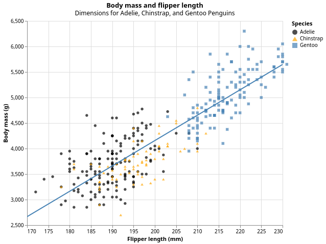

# Data visualization {#sec-data-visualization}

```{r}
#| echo: false
source("_common.R")
```

## Introduction

> "The simple graph has brought more information to the data analyst's mind than any other device." --- John Tukey

Haskell has several systems for making graphs, but hvega is one of the most elegant and most versatile.
Hvega implements a **grammar of graphics**, a coherent system for describing and building graphs.
With hvega, you can do more and faster by learning one system and applying it in many places.

This chapter will teach you how to visualize your data using **hvega**.
We will start by creating a simple scatterplot and use that to introduce aesthetic mappings and geometric objects -- the fundamental building blocks of hvega.
We will then walk you through visualizing distributions of single variables as well as visualizing relationships between two or more variables.
We'll finish off with saving your plots and troubleshooting tips.

### Prerequisites

This chapter focuses on hvega.
You can install it by running:

```         
cabal install --lib hvega
```

## First steps

Do penguins with longer flippers weigh more or less than penguins with shorter flippers?
You probably already have an answer, but try to make your answer precise.
What does the relationship between flipper length and body mass look like?
Is it positive?
Negative?
Linear?
Nonlinear?
Does the relationship vary by the species of the penguin?
How about by the island where the penguin lives?
Let's create visualizations that we can use to answer these questions.

### The `penguins` data frame

You can test your answers to those questions with the `penguins` **data frame** found in which we'll import from a csv file.
A data frame is a rectangular collection of variables (in the columns) and observations (in the rows).
`penguins` contains `r nrow(penguins)` observations collected and made available by Dr. Kristen Gorman and the Palmer Station, Antarctica LTER[^data-visualize-1].

[^data-visualize-1]: Horst AM, Hill AP, Gorman KB (2020).
    palmerpenguins: Palmer Archipelago (Antarctica) penguin data.
    R package version 0.1.0.
    <https://allisonhorst.github.io/palmerpenguins/>.
    doi: 10.5281/zenodo.3960218.

To make the discussion easier, let's define some terms:

-   A **variable** is a quantity, quality, or property that you can measure.

-   A **value** is the state of a variable when you measure it.
    The value of a variable may change from measurement to measurement.

-   An **observation** is a set of measurements made under similar conditions (you usually make all of the measurements in an observation at the same time and on the same object).
    An observation will contain several values, each associated with a different variable.
    We'll sometimes refer to an observation as a data point.

-   **Tabular data** is a set of values, each associated with a variable and an observation.
    Tabular data is *tidy* if each value is placed in its own "cell", each variable in its own column, and each observation in its own row.

In this context, a variable refers to an attribute of all the penguins, and an observation refers to all the attributes of a single penguin.

You can download the data from the [UCI Machine Learning Repository](https://archive.ics.uci.edu/dataset/690/palmer+penguins-3).

```{haskell}
df <- D.readCsv "./data/penguins.csv"
```

This data frame contains `r ncol(penguins)` columns.
We can show the first few columns using the `take` function.

```{haskell}
df <- D.readCsv "./data/penguins.csv"

D.take 5 df
```

Among the variables in `penguins` are:

1.  `species`: a penguin's species (Adelie, Chinstrap, or Gentoo).

2.  `flipper_length_mm`: length of a penguin's flipper, in millimeters.

3.  `body_mass_g`: body mass of a penguin, in grams.

### Ultimate goal {#sec-ultimate-goal}

Our ultimate goal in this chapter is to recreate the following visualization displaying the relationship between flipper lengths and body masses of these penguins, taking into consideration the species of the penguin.



### Creating an hvega plot

Here's the tutorial rewritten with your code but keeping the original narrative:

------------------------------------------------------------------------

## Creating an hvega plot

Let's recreate this plot step-by-step.

First, we need some language extensions and imports:

``` haskell
{-# LANGUAGE OverloadedStrings #-}
{-# LANGUAGE TemplateHaskell #-}

import Graphics.Vega.VegaLite
import IHaskell.Display.Hvega

import qualified DataFrame as D
import qualified DataFrame.Functions as F
```

Next, we load and prepare our data.
The penguins dataset has some missing values, so we filter those out:

``` haskell
df <- fmap (D.filterJust "Flipper Length (mm)" . D.filterJust "Body Mass (g)") 
           (D.readCsv "./data/penguins.csv")

F.declareColumns df
```

The `declareColumns` Template Haskell function creates typed column accessors like `flipper_length_mm`, `body_mass_g`, and `species` that we can use to extract data from the dataframe.

With hvega, you begin a plot with the function `toVegaLite`, which takes a list of specifications that together define your visualization.
The first element is typically the data source.
Using `dataFromColumns` we can extract columns from our dataframe and create the foundation for a plot, but since we haven't told it how to visualize it yet, it's empty.
This is not a very exciting plot, but you can think of it like an empty canvas you'll paint the remaining layers of your plot onto.

``` haskell
penguinPlot :: VegaLite
penguinPlot = toVegaLite
    [ dataFromColumns []
        . dataColumn "flipper_length_mm" (Numbers (D.columnAsList (F.toDouble flipper_length_mm) df))
        . dataColumn "body_mass_g" (Numbers (D.columnAsList (F.toDouble body_mass_g) df))
        . dataColumn "species" (Strings (D.columnAsList species df))
        $ []
    ]
```

Next, we need to tell hvega how the information from our data will be visually represented.
The `encoding` function defines how variables in your dataset are mapped to visual properties (aesthetics) of your plot.
We use `position X` and `position Y` to specify which variables to map to the x and y axes.
For now, we will only map flipper length to the x position and body mass to the y position.
hvega looks for the mapped variables in the data we provided.

``` haskell
penguinPlot :: VegaLite
penguinPlot = toVegaLite
    [ dataFromColumns []
        . dataColumn "flipper_length_mm" (Numbers (D.columnAsList (F.toDouble flipper_length_mm) df))
        . dataColumn "body_mass_g" (Numbers (D.columnAsList (F.toDouble body_mass_g) df))
        . dataColumn "species" (Strings (D.columnAsList species df))
        $ []
    , encoding
        . position X [PName "flipper_length_mm", PmType Quantitative]
        . position Y [PName "body_mass_g", PmType Quantitative]
        $ []
    ]
```

Our empty canvas now has more structure—it's clear where flipper lengths will be displayed (on the x-axis) and where body masses will be displayed (on the y-axis).
But the penguins themselves are not yet on the plot.
This is because we have not yet articulated, in our code, how to represent the observations from our data frame on our plot.

To do so, we need to define a mark: the geometrical object that a plot uses to represent data.
People often describe plots by the type of mark that the plot uses.
For example, bar charts use `Bar` marks, line charts use `Line` marks, and scatterplots use `Point` marks.

``` haskell
penguinPlot :: VegaLite
penguinPlot = toVegaLite
    [ dataFromColumns []
        . dataColumn "flipper_length_mm" (Numbers (D.columnAsList (F.toDouble flipper_length_mm) df))
        . dataColumn "body_mass_g" (Numbers (D.columnAsList (F.toDouble body_mass_g) df))
        . dataColumn "species" (Strings (D.columnAsList species df))
        $ []
    , mark Point []
    , encoding
        . position X [PName "flipper_length_mm", PmType Quantitative]
        . position Y [PName "body_mass_g", PmType Quantitative]
        $ []
    ]

vlShow penguinPlot
```

Now we have something that looks like what we might think of as a "scatterplot".
It doesn't yet match our "ultimate goal" plot, but using this plot we can start answering the question that motivated our exploration: "What does the relationship between flipper length and body mass look like?" The relationship appears to be positive (as flipper length increases, so does body mass), fairly linear (the points are clustered around a line instead of a curve), and moderately strong (there isn't too much scatter around such a line).
Penguins with longer flippers are generally larger in terms of their body mass.

### Adding aesthetics and layers

Scatterplots are useful for displaying the relationship between two numerical variables, but it's always a good idea to be skeptical of any apparent relationship between two variables and ask if there may be other variables that explain or change the nature of this apparent relationship.
For example, does the relationship between flipper length and body mass differ by species?
Let's incorporate species into our plot and see if this reveals any additional insights into the apparent relationship between these variables.
We will do this by representing species with different colored points.

To achieve this, will we need to modify the encoding or the mark?
If you guessed "in the encoding", you're already getting the hang of creating data visualizations with hvega!

``` haskell
    , encoding
        . position X [PName "flipper_length_mm", PmType Quantitative]
        . position Y [PName "body_mass_g", PmType Quantitative]
        . color [MName "species", MmType Nominal]
        $ []
```

When a categorical variable is mapped to an aesthetic, Vega-Lite will automatically assign a unique value of the aesthetic (here a unique color) to each unique level of the variable (each of the three species), a process known as scaling.
Vega-Lite will also add a legend that explains which values correspond to which levels.

Now let's add one more layer: a smooth curve displaying the relationship between body mass and flipper length.
Before you proceed, refer back to the code above, and think about how we can add this to our existing plot.

Since this is a new geometric object representing our data, we will add a new mark as a layer on top of our point mark.
In hvega, when we need multiple marks, we use `layer` to combine separate specifications, each defined with `asSpec`:

``` haskell
penguinPlot :: VegaLite
penguinPlot = toVegaLite
    [ dataFromColumns []
        . dataColumn "flipper_length_mm" (Numbers (D.columnAsList (F.toDouble flipper_length_mm) df))
        . dataColumn "body_mass_g" (Numbers (D.columnAsList (F.toDouble body_mass_g) df))
        . dataColumn "species" (Strings (D.columnAsList species df))
        $ []
    , encoding
        . position X [PName "flipper_length_mm", PmType Quantitative]
        . position Y [PName "body_mass_g", PmType Quantitative]
        . color [MName "species", MmType Nominal]
        $ []
    , layer [pointLayer, regressionLayer]
    ]

pointLayer :: VLSpec
pointLayer = asSpec
    [ mark Point []
    ]

regressionLayer :: VLSpec
regressionLayer = asSpec
    [ mark Line []
    , transform
        . regression "body_mass_g" "flipper_length_mm" []
        $ []
    ]
```

We have successfully added lines, but this plot doesn't look like the plot from the beginning, which only has one line for the entire dataset as opposed to separate lines for each of the penguin species.

When aesthetic mappings are defined at the top level of `toVegaLite`, they're passed down to each of the subsequent layers of the plot.
However, each layer can also take its own `encoding`, which allows for aesthetic mappings at the local level that are added to those inherited from the global level.
Since we want points to be colored based on species but don't want the lines to be separated out for them, we should specify `color` for `pointLayer` only.

``` haskell
penguinPlot :: VegaLite
penguinPlot = toVegaLite
    [ dataFromColumns []
        . dataColumn "flipper_length_mm" (Numbers (D.columnAsList (F.toDouble flipper_length_mm) df))
        . dataColumn "body_mass_g" (Numbers (D.columnAsList (F.toDouble body_mass_g) df))
        . dataColumn "species" (Strings (D.columnAsList species df))
        $ []
    , encoding
        . position X [PName "flipper_length_mm", PmType Quantitative]
        . position Y [PName "body_mass_g", PmType Quantitative]
        $ []
    , layer [pointLayer, regressionLayer]
    ]

pointLayer :: VLSpec
pointLayer = asSpec
    [ mark Point []
    , encoding
        . color [MName "species", MmType Nominal]
        $ []
    ]

regressionLayer :: VLSpec
regressionLayer = asSpec
    [ mark Line []
    , transform
        . regression "body_mass_g" "flipper_length_mm" []
        $ []
    ]
```

Voila!
We have something that looks very much like our ultimate goal, though it's not yet perfect.
We still need to use different shapes for each species of penguins and improve labels.

It's generally not a good idea to represent information using only colors on a plot, as people perceive colors differently due to color blindness or other color vision differences.
Therefore, in addition to color, we can also map species to the `shape` aesthetic:

``` haskell
pointLayer :: VLSpec
pointLayer = asSpec
    [ mark Point [MFilled True]
    , encoding
        . color [MName "species", MmType Nominal]
        . shape [MName "species", MmType Nominal]
        $ []
    ]
```

We add `MFilled True` to fill the shapes with color.
Note that the legend is automatically updated to reflect the different shapes of the points as well.

And finally, we can improve the labels of our plot using `title` and `PTitle`.
We add a title and subtitle to the plot, and customize the axis labels.
In addition, we can customize the color palette and shapes using `MScale`:

``` haskell
penguinPlot :: VegaLite
penguinPlot = toVegaLite
    [ title "Body mass and flipper length" 
        [ TSubtitle "Dimensions for Adelie, Chinstrap, and Gentoo Penguins" ]
    , dataFromColumns []
        . dataColumn "flipper_length_mm" (Numbers (D.columnAsList (F.toDouble flipper_length_mm) df))
        . dataColumn "body_mass_g" (Numbers (D.columnAsList (F.toDouble body_mass_g) df))
        . dataColumn "species" (Strings (D.columnAsList species df))
        $ []
    , width 500
    , height 400
    , encoding
        . position X [ PName "flipper_length_mm"
                     , PmType Quantitative
                     , PTitle "Flipper length (mm)"
                     , PScale [SDomain (DNumbers [170, 230])]
                     ]
        . position Y [ PName "body_mass_g"
                     , PmType Quantitative
                     , PTitle "Body mass (g)"
                     , PScale [SDomain (DNumbers [2500, 6500])]
                     ]
        $ []
    , layer [pointLayer, regressionLayer]
    ]

pointLayer :: VLSpec
pointLayer = asSpec
    [ mark Point [MFilled True]
    , encoding
        . color [ MName "species"
                , MmType Nominal
                , MTitle "Species"
                , MScale [SRange (RStrings ["black", "orange", "steelblue"])]
                ]
        . shape [ MName "species"
                , MmType Nominal
                , MScale [SRange (RStrings ["circle", "triangle-up", "square"])]
                ]
        $ []
    ]

regressionLayer :: VLSpec
regressionLayer = asSpec
    [ mark Line [MClip True]
    , transform
        . regression "body_mass_g" "flipper_length_mm" 
            [RgExtent 170 230]
        $ []
    , encoding
        . color [MString "steelblue"]
        $ []
    ]

vlShow penguinPlot
```

We finally have a plot that perfectly matches our "ultimate goal"!

### Exercises

1.  How many rows are in `penguins`?
    How many columns?

2.  Make a scatterplot of `bill_depth_mm` vs. `bill_length_mm`.
    That is, make a scatterplot with `bill_depth_mm` on the y-axis and `bill_length_mm` on the x-axis.
    Describe the relationship between these two variables.

3.  What happens if you make a scatterplot of `species` vs. `bill_depth_mm`?

4.  Add the following caption to the plot you made in the previous exercise: "Data come from the palmerpenguins package."

## Visualizing distributions

How you visualize the distribution of a variable depends on the type of variable: categorical or numerical.

### A categorical variable

A variable is **categorical** if it can only take one of a small set of values.
To examine the distribution of a categorical variable, you can use a bar chart.
The height of the bars displays how many observations occurred with each `x` value.

In bar plots of categorical variables with non-ordered levels, like the penguin `species` above, it's often preferable to reorder the bars based on their frequencies.
Doing so requires transforming the variable to a factor (how R handles categorical data) and then reordering the levels of that factor.

### A numerical variable

A variable is **numerical** (or quantitative) if it can take on a wide range of numerical values, and it is sensible to add, subtract, or take averages with those values.
Numerical variables can be continuous or discrete.

One commonly used visualization for distributions of continuous variables is a histogram.

A histogram divides the x-axis into equally spaced bins and then uses the height of a bar to display the number of observations that fall in each bin.
In the graph above, the tallest bar shows that 39 observations have a `body_mass_g` value between 3,500 and 3,700 grams, which are the left and right edges of the bar.

You can set the width of the intervals in a histogram with the `BinProperty` strcuture in HVega, which is measured in the units of the `x` variable.
You should always explore a variety of bin widths when working with histograms, as different bin widths can reveal different patterns.

An alternative visualization for distributions of numerical variables is a density plot.
A density plot is a smoothed-out version of a histogram and a practical alternative, particularly for continuous data that comes from an underlying smooth distribution.

### Exercises

1.  Make a bar plot of `species` of `penguins`, where you assign `species` to the `y` aesthetic.
    How is this plot different?

2.  Make a histogram of the `carat` variable in the `diamonds` dataset.
    Experiment with different bin widths.
    What bin width reveals the most interesting patterns?

## Visualizing relationships

To visualize a relationship we need to have at least two variables mapped to aesthetics of a plot.
In the following sections you will learn about commonly used plots for visualizing relationships between two or more variables and the geoms used for creating them.

### A numerical and a categorical variable

To visualize the relationship between a numerical and a categorical variable we can use side-by-side box plots.
A **boxplot** is a type of visual shorthand for measures of position (percentiles) that describe a distribution.
It is also useful for identifying potential outliers.
As shown in @fig-eda-boxplot, each boxplot consists of:

-   A box that indicates the range of the middle half of the data, a distance known as the interquartile range (IQR), stretching from the 25th percentile of the distribution to the 75th percentile.
    In the middle of the box is a line that displays the median, i.e. 50th percentile, of the distribution.
    These three lines give you a sense of the spread of the distribution and whether or not the distribution is symmetric about the median or skewed to one side.

-   Visual points that display observations that fall more than 1.5 times the IQR from either edge of the box.
    These outlying points are unusual so are plotted individually.

-   A line (or whisker) that extends from each end of the box and goes to the farthest non-outlier point in the distribution.

### Two categorical variables

We can use stacked bar plots to visualize the relationship between two categorical variables.
For example, the following two stacked bar plots both display the relationship between `island` and `species`, or specifically, visualizing the distribution of `species` within each island.

The first plot shows the frequencies of each species of penguins on each island.
The plot of frequencies shows that there are equal numbers of Adelies on each island.
But we don't have a good sense of the percentage balance within each island.

The second plot, a relative frequency plot created by setting `position = "fill"` in the geom, is more useful for comparing species distributions across islands since it's not affected by the unequal numbers of penguins across the islands.
Using this plot we can see that Gentoo penguins all live on Biscoe island and make up roughly 75% of the penguins on that island, Chinstrap all live on Dream island and make up roughly 50% of the penguins on that island, and Adelie live on all three islands and make up all of the penguins on Torgersen.

### Two numerical variables

A scatterplot is probably the most commonly used plot for visualizing the relationship between two numerical variables.

### Three or more variables

As we saw in @sec-adding-aesthetics-layers, we can incorporate more variables into a plot by mapping them to additional aesthetics.
For example, in the following scatterplot the colors of points represent species and the shapes of points represent islands.

However adding too many aesthetic mappings to a plot makes it cluttered and difficult to make sense of.
Another way, which is particularly useful for categorical variables, is to split your plot into **facets**, subplots that each display one subset of the data.

<!--TODO: Add a section on facets. -->

### Exercises

1.  The following questions are about the `mpg` dataset.
    Which variables in `mpg` are categorical?
    Which variables are numerical?

2.  Make a scatterplot of `hwy` vs. `displ` using the `mpg` data frame.

3.  What happens if you map the same variable to multiple aesthetics?

4.  Make a scatterplot of `bill_depth_mm` vs. `bill_length_mm` and color the points by `species`.
    What does adding coloring by species reveal about the relationship between these two variables?

5.  Create the two following stacked bar plots.
    Which question can you answer with the first one?
    Which question can you answer with the second one?

## Saving your plots {#sec-ggsave}

Once you've made a plot, you might want to get it out of Haskell by saving it as an image that you can use elsewhere.
HVega plots always have a menu on the top right of the image that allows you to save images.

## Summary

In this chapter, you've learned the basics of data visualization with hvega.
You then learned about increasing the complexity and improving the presentation of your plots layer-by-layer.
You also learned about commonly used plots for visualizing the distribution of a single variable as well as for visualizing relationships between two or more variables.

We'll use visualizations again and again throughout this book, introducing new techniques as we need them as well as do a deeper dive into creating visualizations with ggplot2 in @sec-layers through @sec-communication.

With the basics of visualization under your belt, in the next chapter we're going to switch gears a little and give you some practical workflow advice.
We intersperse workflow advice with data science tools throughout this part of the book because it'll help you stay organized as you write increasing amounts of Haskell code.
